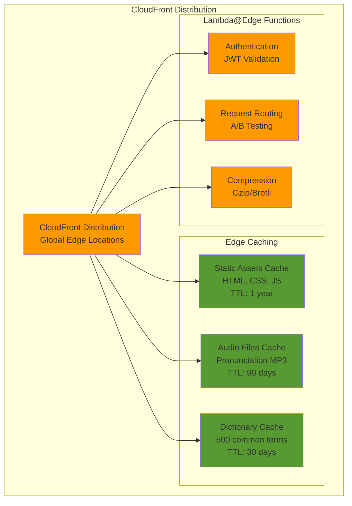
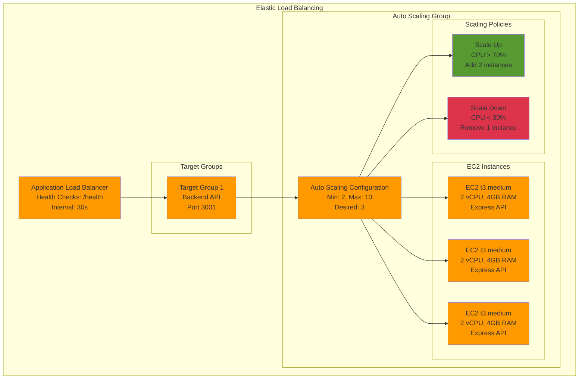
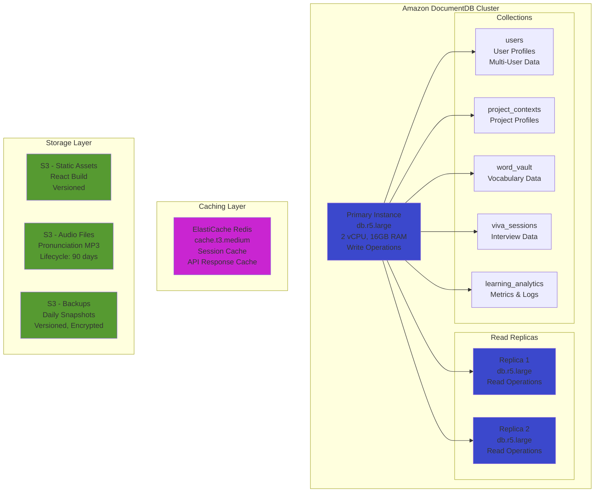
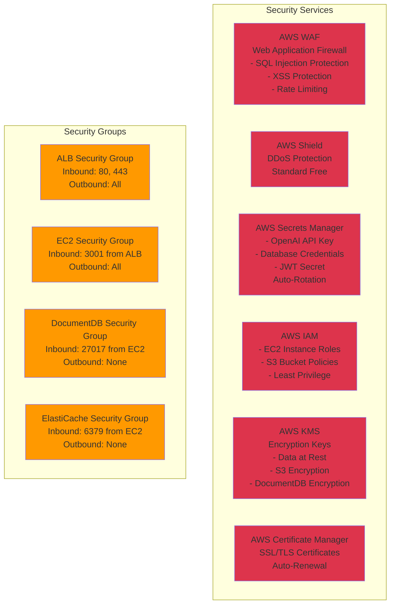
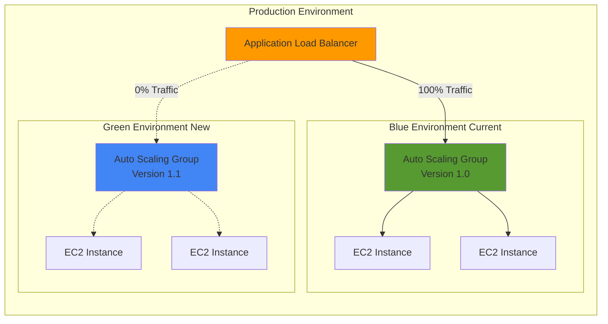

# CTC Tutor - Bharat-First AI Learning Platform
## Comprehensive Design Document for AI for Bharat Submission

---

## 🎯 Document Overview

This design document provides the complete technical architecture, system design, component specifications, and implementation details for CTC Tutor - a comprehensive, NEP 2020-aligned, Bharat-first AI-powered learning platform.

**Companion Document**: AI_FOR_BHARAT_REQUIREMENTS.md

---

## 📐 Design Principles

1. **Modularity**: Each feature is a self-contained module that can be developed and tested independently
2. **Integration**: Features enhance existing functionality without breaking current features
3. **Performance**: Client-side processing where possible, server-side for complex operations
4. **Scalability**: Design supports 1000+ concurrent users, 500K+ total users
5. **Security**: Sandboxed code execution, encrypted data storage, privacy-first
6. **User Experience**: Intuitive UI, fast response times, clear feedback
7. **Accessibility**: WCAG 2.1 AAA compliance, universal design
8. **Offline-First**: 100% core functionality works without internet
9. **Mobile-First**: Optimized for low-end Android devices
10. **Rural-First**: Designed for Indian rural context

---

## 🏗️ System Architecture

### High-Level Architecture

```
┌─────────────────────────────────────────────────────────────────────┐
│                     Frontend Layer (React PWA)                       │
│  ┌──────────────┐  ┌──────────────┐  ┌──────────────┐             │
│  │ NEP 2020     │  │  Dictionary  │  │   Market     │             │
│  │  Modules     │  │  & Vocab     │  │  Disruptors  │             │
│  │  (1-10)      │  │  Builder     │  │  (5 features)│             │
│  └──────────────┘  └──────────────┘  └──────────────┘             │
│  ┌──────────────────────────────────────────────────────┐          │
│  │  Core Components: Voice, Language, Offline, Audio    │          │
│  └──────────────────────────────────────────────────────┘          │
└─────────────────────────────────────────────────────────────────────┘
                            │
                            │ REST API (HTTPS)
                            ▼
┌─────────────────────────────────────────────────────────────────────┐
│                    Backend Layer (Express + TypeScript)              │
│  ┌──────────────────────────────────────────────────────────────┐  │
│  │              Enhanced Services                                │  │
│  │  • AIService (GPT-4 + Mock)                                  │  │
│  │  • PedagogicalAnalyzer                                       │  │
│  │  • ProjectContextService                                     │  │
│  │  • StressTestService                                         │  │
│  │  • ArchitectureService                                       │  │
│  │  • StyleAdapterService                                       │  │
│  │  • VivaInterviewService                                      │  │
│  │  • DictionaryService                                         │  │
│  │  • TranslationService                                        │  │
│  │  • VoiceService                                              │  │
│  └──────────────────────────────────────────────────────────────┘  │
└─────────────────────────────────────────────────────────────────────┘
                            │
                            │ Storage & External APIs
                            ▼
┌─────────────────────────────────────────────────────────────────────┐
│                    Data & Integration Layer                          │
│  ┌──────────────┐  ┌──────────────┐  ┌──────────────┐             │
│  │ LocalStorage │  │   IndexedDB  │  │   MongoDB    │             │
│  │  (Phase 1)   │  │   (Offline)  │  │  (Phase 2)   │             │
│  └──────────────┘  └──────────────┘  └──────────────┘             │
│  ┌──────────────┐  ┌──────────────┐  ┌──────────────┐             │
│  │  OpenAI API  │  │  Google Cloud│  │  Cloudflare  │             │
│  │   (GPT-4)    │  │  (Speech/TTS)│  │   (CDN/Edge) │             │
│  └──────────────┘  └──────────────┘  └──────────────┘             │
└─────────────────────────────────────────────────────────────────────┘
```

---

## 🔧 Technology Stack

### Frontend Technologies
- **Framework**: React 18+ with TypeScript
- **Build Tool**: Create React App (CRA) with TypeScript template
- **Styling**: Tailwind CSS 3.x (utility-first, responsive)
- **State Management**: React Context API + useState/useReducer
- **Routing**: React Router v6
- **Icons**: Lucide React (tree-shakeable)
- **Diagrams**: Mermaid.js 10.x + D3.js 7.x
- **Code Highlighting**: Prism.js
- **Voice**: Web Speech API (browser native)
- **PWA**: Workbox (service workers)
- **Storage**: IndexedDB (via idb library)
- **HTTP Client**: Axios

### Backend Technologies
- **Runtime**: Node.js 18+ LTS
- **Framework**: Express.js 4.x with TypeScript
- **Language**: TypeScript 5.x
- **AI Integration**: OpenAI SDK (GPT-4)
- **Translation**: Google Cloud Translation API
- **Speech**: Google Cloud Speech-to-Text & Text-to-Speech
- **Database**: MongoDB 6.x (Phase 2)
- **Caching**: Redis 7.x (Phase 2)
- **Validation**: Zod (TypeScript-first schema validation)
- **Logging**: Winston
- **Testing**: Jest + Supertest

### Infrastructure & DevOps
- **Hosting**: AWS (EC2, S3, CloudFront) or Azure or GCP
- **CDN**: Cloudflare (global distribution, edge computing)
- **Edge Computing**: Cloudflare Workers
- **CI/CD**: GitHub Actions
- **Monitoring**: Sentry (error tracking), Google Analytics
- **Performance**: Lighthouse CI
- **Security**: Helmet.js, CORS, Rate Limiting

### Development Tools
- **Version Control**: Git + GitHub
- **Package Manager**: npm
- **Code Quality**: ESLint + Prettier
- **Type Checking**: TypeScript strict mode
- **Testing**: Jest + React Testing Library
- **API Testing**: Postman + Swagger/OpenAPI

---

## 📦 Component Architecture

### Frontend Component Hierarchy

```
App.tsx (LanguageProvider)
├── Header.tsx (Language Selector, User Menu)
├── GlobalVoiceControl.tsx (Floating Mic Button)
├── Sidebar.tsx (Navigation)
└── Main Content
    ├── ConceptExplainer.tsx
    │   ├── ExplanationCard.tsx
    │   ├── VisualDiagram.tsx (Mermaid)
    │   ├── CodeExample.tsx
    │   ├── CommonMistakes.tsx
    │   ├── RevisionSummary.tsx
    │   └── VoiceAssist.tsx
    ├── CodeAnalyzer.tsx
    │   ├── LogicFirstExplanation.tsx
    │   ├── DryRunTable.tsx
    │   ├── ComplexityVisualizer.tsx
    │   ├── EdgeCaseReport.tsx
    │   ├── KnowledgeCheckQuiz.tsx
    │   ├── BestPracticesSuggestions.tsx
    │   └── CodeComplexityMeter.tsx
    ├── StudyMode.tsx
    │   ├── VisionUpload.tsx
    │   └── ProjectContextManager.tsx
    ├── DictionaryCard.tsx (One-Tap Dictionary)
    │   ├── DualLanguageToggle.tsx
    │   ├── PronunciationPlayer.tsx
    │   └── WordVault.tsx
    └── Market Disruptor Features
        ├── ProjectContextManager.tsx
        ├── StressTestSandbox.tsx
        ├── ArchitectureVisualizer.tsx
        ├── StyleSelector.tsx
        └── VivaInterviewer.tsx
```

---

## 🗄️ Data Models & Database Schema

### Core Data Models (TypeScript Interfaces)

```typescript
// User Profile (Multi-User Support)
interface UserProfile {
  id: string;
  name: string;
  avatar: string;
  language: Language;
  createdAt: Date;
  preferences: {
    voiceEnabled: boolean;
    audioSpeed: number;
    studyStyle: StudyStyle;
    contextPreference: 'village' | 'city' | 'personalized';
  };
  progress: {
    conceptsLearned: string[];
    codeAnalyzed: number;
    quizzesCompleted: number;
    xp: number;
    level: number;
  };
}

// Language Support
type Language = 'en' | 'hi' | 'mr' | 'ta' | 'te' | 'bn' | 'gu' | 'kn' | 'ml' | 'pa';

// Project Context (Market Disruptor Feature)
interface ProjectContext {
  id: string;
  name: string;
  type: 'web_app' | 'mobile_app' | 'iot' | 'data_science' | 'ml' | 'other';
  domain: 'healthcare' | 'environment' | 'finance' | 'education' | 'social' | 'other';
  techStack: {
    frontend?: string[];
    backend?: string[];
    database?: string[];
    other?: string[];
  };
  dataCharacteristics: {
    type: 'real_time' | 'batch' | 'streaming' | 'user_input' | 'api';
    volume: 'small' | 'medium' | 'large' | 'massive';
    velocity: 'slow' | 'moderate' | 'fast' | 'real_time';
  };
  description: string;
  createdAt: Date;
  updatedAt: Date;
}

// Dictionary Entry (One-Tap Dictionary)
interface DictionaryEntry {
  term: string;
  simpleDefinition: string;
  translations: Record<Language, string>;
  codeExample: string;
  pronunciation: {
    audioUrl: string;
    ipa: string;
    tips: string;
  };
  subject: 'DSA' | 'OS' | 'DBMS' | 'Python' | 'Java' | 'WebDev' | 'Networking';
  difficulty: 'beginner' | 'intermediate' | 'advanced';
}

// Word Vault Entry (Vocabulary Builder)
interface WordVaultEntry {
  entryId: string;
  term: string;
  dateAdded: Date;
  timesReviewed: number;
  masteryLevel: number; // 0-100
  nextReviewDate: Date;
  quizHistory: QuizAttempt[];
}
```


### MongoDB Collections (Phase 2)

```javascript
// users collection
{
  _id: ObjectId,
  profiles: [UserProfile],
  deviceId: String,
  createdAt: Date,
  lastActive: Date
}

// project_contexts collection
{
  _id: ObjectId,
  userId: ObjectId,
  ...ProjectContext
}

// word_vault collection
{
  _id: ObjectId,
  userId: ObjectId,
  entries: [WordVaultEntry]
}

// viva_sessions collection
{
  _id: ObjectId,
  userId: ObjectId,
  ...VivaSession
}

// learning_analytics collection
{
  _id: ObjectId,
  userId: ObjectId,
  date: Date,
  metrics: {
    timeSpent: Number,
    conceptsLearned: Number,
    codeAnalyzed: Number,
    voiceInteractions: Number,
    offlineTime: Number
  }
}
```

---

## 🔌 API Specifications

### Base URL
- **Development**: `http://localhost:3001/api`
- **Production**: `https://api.ctctutor.in/api`

### Authentication
- Phase 1: No authentication (device-based)
- Phase 2: JWT tokens for multi-device sync

### Core API Endpoints

#### Concept Explanation
```
POST /concepts/explain
Body: {
  topic: string,
  language?: Language,
  context?: 'village' | 'city' | 'personalized',
  style?: StudyStyle
}
Response: ConceptResponse
```

#### Code Analysis
```
POST /code-analysis/analyze
Body: {
  code: string,
  language: string,
  contextId?: string,
  style?: StudyStyle
}
Response: EnhancedCodeAnalysisResponse
```


#### Dictionary API
```
POST /dictionary/lookup
Body: { term: string, language: Language }
Response: DictionaryEntry

GET /dictionary/cache
Response: { entries: DictionaryEntry[] } // 500 most common terms

POST /word-vault/save
Body: { term: string, userId: string }
Response: { success: boolean }

GET /word-vault/entries
Query: { userId: string }
Response: { entries: WordVaultEntry[] }

POST /word-vault/quiz
Body: { userId: string }
Response: { question: QuizQuestion }

POST /word-vault/submit-quiz
Body: { userId: string, questionId: string, answer: string }
Response: { correct: boolean, feedback: string }
```

#### Project Context API
```
POST /project-context/create
Body: ProjectContext
Response: { projectContext: ProjectContext }

GET /project-context/list
Query: { userId: string }
Response: { contexts: ProjectContext[] }

POST /project-context/analyze
Body: { code: string, language: string, contextId: string }
Response: { analysis: ContextAwareAnalysis }
```

#### Stress Test API
```
POST /stress-test/generate
Body: { code: string, language: string }
Response: { tests: StressTest[] }

POST /stress-test/execute
Body: { code: string, language: string, tests: StressTest[] }
Response: { report: StressTestReport }
```


#### Architecture API
```
POST /architecture/analyze
Body: { code: string, language: string, projectContext?: ProjectContext }
Response: { blueprint: ArchitectureBlueprint }

POST /architecture/generate-diagram
Body: { type: 'system' | 'state' | 'sequence', data: any }
Response: { mermaidCode: string }
```

#### Viva-Voce API
```
POST /viva/start-session
Body: { code: string, language: string, sessionType: string, difficulty: string }
Response: { session: VivaSession }

POST /viva/submit-response
Body: { sessionId: string, questionId: string, transcript: string, duration: number }
Response: { evaluation: VivaResponse }

GET /viva/report/:sessionId
Response: { report: VivaReport }
```

#### Translation API
```
POST /translation/translate
Body: { text: string, from: Language, to: Language }
Response: { translatedText: string }

POST /translation/batch
Body: { texts: string[], from: Language, to: Language }
Response: { translations: string[] }
```

#### Voice API
```
POST /voice/synthesize
Body: { text: string, language: Language, speed: number }
Response: { audioUrl: string }

POST /voice/recognize
Body: { audioData: Blob, language: Language }
Response: { transcript: string, confidence: number }
```

---

## 🎨 UI/UX Design System

### Design Tokens

```css
/* Colors */
--primary-50: #f0f9ff;
--primary-100: #e0f2fe;
--primary-500: #0ea5e9;
--primary-600: #0284c7;
--primary-700: #0369a1;

--success-500: #22c55e;
--warning-500: #f59e0b;
--error-500: #ef4444;

--gray-50: #f9fafb;
--gray-100: #f3f4f6;
--gray-500: #6b7280;
--gray-900: #111827;

/* Typography */
--font-sans: 'Inter', system-ui, sans-serif;
--font-mono: 'Fira Code', monospace;

--text-xs: 0.75rem;
--text-sm: 0.875rem;
--text-base: 1rem;
--text-lg: 1.125rem;
--text-xl: 1.25rem;
--text-2xl: 1.5rem;

/* Spacing */
--space-1: 0.25rem;
--space-2: 0.5rem;
--space-4: 1rem;
--space-6: 1.5rem;
--space-8: 2rem;

/* Border Radius */
--radius-sm: 0.25rem;
--radius-md: 0.375rem;
--radius-lg: 0.5rem;
--radius-full: 9999px;

/* Shadows */
--shadow-sm: 0 1px 2px 0 rgb(0 0 0 / 0.05);
--shadow-md: 0 4px 6px -1px rgb(0 0 0 / 0.1);
--shadow-lg: 0 10px 15px -3px rgb(0 0 0 / 0.1);
```

### Component Patterns

#### Button Variants
```tsx
// Primary Button
<button className="bg-primary-500 text-white px-4 py-2 rounded-md hover:bg-primary-600">
  Primary Action
</button>

// Secondary Button
<button className="bg-gray-100 text-gray-900 px-4 py-2 rounded-md hover:bg-gray-200">
  Secondary Action
</button>

// Voice Button (Floating)
<button className="fixed bottom-6 right-6 bg-primary-500 text-white p-4 rounded-full shadow-lg">
  <Mic className="w-6 h-6" />
</button>
```


#### Card Components
```tsx
// Explanation Card
<div className="bg-white rounded-lg shadow-md p-6 space-y-4">
  <h3 className="text-xl font-bold text-gray-900">Concept Title</h3>
  <p className="text-gray-700">Explanation content...</p>
</div>

// Dictionary Card (Popup)
<div className="absolute z-50 bg-white rounded-lg shadow-xl p-4 max-w-sm">
  <div className="flex justify-between items-start mb-2">
    <h4 className="font-bold text-lg">Term</h4>
    <button className="text-gray-400 hover:text-gray-600">×</button>
  </div>
  <p className="text-sm text-gray-600 mb-2">Simple definition...</p>
  <p className="text-sm text-primary-600 mb-2">Regional translation...</p>
  <pre className="bg-gray-100 p-2 rounded text-xs">Code example</pre>
  <button className="mt-2 text-primary-500 hover:text-primary-600">
    <Speaker className="w-4 h-4 inline mr-1" /> Pronounce
  </button>
</div>
```

### Responsive Design Breakpoints

```css
/* Mobile First Approach */
/* Default: Mobile (< 640px) */

/* Tablet */
@media (min-width: 640px) { /* sm */ }
@media (min-width: 768px) { /* md */ }

/* Desktop */
@media (min-width: 1024px) { /* lg */ }
@media (min-width: 1280px) { /* xl */ }
```

### Accessibility Features

```tsx
// Screen Reader Support
<button aria-label="Start voice input" aria-pressed={isListening}>
  <Mic />
</button>

// Keyboard Navigation
<div role="dialog" aria-modal="true" aria-labelledby="dialog-title">
  <h2 id="dialog-title">Dictionary Entry</h2>
  {/* Content */}
</div>

// Focus Management
<input
  ref={inputRef}
  onFocus={() => setFocused(true)}
  className="focus:ring-2 focus:ring-primary-500 focus:outline-none"
/>

// High Contrast Mode
<div className="high-contrast:bg-black high-contrast:text-white">
  Content
</div>
```

---

## 🔊 Voice & Speech Architecture

### Web Speech API Integration

```typescript
// Speech Recognition (Voice Input)
class VoiceRecognitionService {
  private recognition: SpeechRecognition;
  
  constructor(language: Language) {
    this.recognition = new (window.SpeechRecognition || window.webkitSpeechRecognition)();
    this.recognition.lang = this.getLanguageCode(language);
    this.recognition.continuous = true;
    this.recognition.interimResults = true;
  }
  
  start(onResult: (transcript: string) => void, onError: (error: string) => void) {
    this.recognition.onresult = (event) => {
      const transcript = Array.from(event.results)
        .map(result => result[0].transcript)
        .join('');
      onResult(transcript);
    };
    
    this.recognition.onerror = (event) => {
      onError(event.error);
    };
    
    this.recognition.start();
  }
  
  stop() {
    this.recognition.stop();
  }
  
  private getLanguageCode(language: Language): string {
    const codes: Record<Language, string> = {
      'en': 'en-IN',
      'hi': 'hi-IN',
      'mr': 'mr-IN',
      'ta': 'ta-IN',
      'te': 'te-IN',
      'bn': 'bn-IN',
      'gu': 'gu-IN',
      'kn': 'kn-IN',
      'ml': 'ml-IN',
      'pa': 'pa-IN'
    };
    return codes[language] || 'en-IN';
  }
}

// Text-to-Speech (Voice Output)
class TextToSpeechService {
  private synth: SpeechSynthesis;
  
  constructor() {
    this.synth = window.speechSynthesis;
  }
  
  speak(text: string, language: Language, rate: number = 1.0) {
    const utterance = new SpeechSynthesisUtterance(text);
    utterance.lang = this.getLanguageCode(language);
    utterance.rate = rate;
    utterance.pitch = 1.0;
    utterance.volume = 1.0;
    
    this.synth.speak(utterance);
  }
  
  stop() {
    this.synth.cancel();
  }
  
  pause() {
    this.synth.pause();
  }
  
  resume() {
    this.synth.resume();
  }
}
```

### Voice Command Processing

```typescript
// Voice Command Parser
class VoiceCommandParser {
  parseCommand(transcript: string, language: Language): VoiceCommand | null {
    const lowerTranscript = transcript.toLowerCase();
    
    // Navigation commands
    if (this.matchesPattern(lowerTranscript, ['open', 'go to', 'show'], language)) {
      if (this.contains(lowerTranscript, ['code', 'analyzer'], language)) {
        return { type: 'navigate', target: 'code-analysis' };
      }
      if (this.contains(lowerTranscript, ['concept', 'explain'], language)) {
        return { type: 'navigate', target: 'concepts' };
      }
      if (this.contains(lowerTranscript, ['study', 'mode'], language)) {
        return { type: 'navigate', target: 'study-mode' };
      }
    }
    
    // Action commands
    if (this.matchesPattern(lowerTranscript, ['analyze', 'check'], language)) {
      return { type: 'action', action: 'analyze' };
    }
    if (this.matchesPattern(lowerTranscript, ['explain', 'tell me'], language)) {
      return { type: 'action', action: 'explain' };
    }
    
    return null;
  }
  
  private matchesPattern(text: string, patterns: string[], language: Language): boolean {
    // Check patterns in both English and target language
    return patterns.some(pattern => text.includes(pattern));
  }
}
```

---

## 📴 Offline Architecture

### Service Worker Strategy

```typescript
// service-worker.ts
import { precacheAndRoute } from 'workbox-precaching';
import { registerRoute } from 'workbox-routing';
import { CacheFirst, NetworkFirst, StaleWhileRevalidate } from 'workbox-strategies';
import { ExpirationPlugin } from 'workbox-expiration';

// Precache static assets
precacheAndRoute(self.__WB_MANIFEST);

// Cache API responses
registerRoute(
  ({ url }) => url.pathname.startsWith('/api/dictionary'),
  new CacheFirst({
    cacheName: 'dictionary-cache',
    plugins: [
      new ExpirationPlugin({
        maxEntries: 500,
        maxAgeSeconds: 30 * 24 * 60 * 60, // 30 days
      }),
    ],
  })
);

registerRoute(
  ({ url }) => url.pathname.startsWith('/api/concepts'),
  new NetworkFirst({
    cacheName: 'concepts-cache',
    plugins: [
      new ExpirationPlugin({
        maxEntries: 100,
        maxAgeSeconds: 7 * 24 * 60 * 60, // 7 days
      }),
    ],
  })
);

// Cache audio files
registerRoute(
  ({ url }) => url.pathname.includes('/audio/'),
  new CacheFirst({
    cacheName: 'audio-cache',
    plugins: [
      new ExpirationPlugin({
        maxEntries: 500,
        maxAgeSeconds: 90 * 24 * 60 * 60, // 90 days
      }),
    ],
  })
);

// Background sync for analytics
self.addEventListener('sync', (event) => {
  if (event.tag === 'sync-analytics') {
    event.waitUntil(syncAnalytics());
  }
});

async function syncAnalytics() {
  const db = await openDB('analytics-db');
  const pendingEvents = await db.getAll('pending-events');
  
  for (const event of pendingEvents) {
    try {
      await fetch('/api/analytics', {
        method: 'POST',
        body: JSON.stringify(event),
      });
      await db.delete('pending-events', event.id);
    } catch (error) {
      console.error('Failed to sync event:', error);
    }
  }
}
```

### IndexedDB Schema

```typescript
// db.ts
import { openDB, DBSchema } from 'idb';

interface CTCTutorDB extends DBSchema {
  'user-profiles': {
    key: string;
    value: UserProfile;
  };
  'dictionary-cache': {
    key: string;
    value: DictionaryEntry;
  };
  'word-vault': {
    key: string;
    value: WordVaultEntry;
  };
  'project-contexts': {
    key: string;
    value: ProjectContext;
  };
  'learning-history': {
    key: string;
    value: LearningSession;
  };
  'pending-sync': {
    key: string;
    value: SyncItem;
  };
}

export async function initDB() {
  return openDB<CTCTutorDB>('ctc-tutor-db', 1, {
    upgrade(db) {
      db.createObjectStore('user-profiles', { keyPath: 'id' });
      db.createObjectStore('dictionary-cache', { keyPath: 'term' });
      db.createObjectStore('word-vault', { keyPath: 'entryId' });
      db.createObjectStore('project-contexts', { keyPath: 'id' });
      db.createObjectStore('learning-history', { keyPath: 'id' });
      db.createObjectStore('pending-sync', { keyPath: 'id' });
    },
  });
}
```

---

## 🔐 Security Architecture

### Code Execution Sandbox

```typescript
// sandbox-executor.ts
export class SandboxExecutor {
  private worker: Worker | null = null;
  
  async executeCode(
    code: string,
    language: string,
    input: any,
    timeout: number = 5000
  ): Promise<ExecutionResult> {
    return new Promise((resolve, reject) => {
      // Create isolated Web Worker
      this.worker = new Worker('/sandbox-worker.js');
      
      // Set execution timeout
      const timeoutId = setTimeout(() => {
        this.worker?.terminate();
        reject(new Error('Execution timeout exceeded'));
      }, timeout);
      
      // Listen for results
      this.worker.onmessage = (event) => {
        clearTimeout(timeoutId);
        this.worker?.terminate();
        resolve(event.data);
      };
      
      // Listen for errors
      this.worker.onerror = (error) => {
        clearTimeout(timeoutId);
        this.worker?.terminate();
        reject(error);
      };
      
      // Send code to worker
      this.worker.postMessage({
        code: this.sanitizeCode(code),
        language,
        input,
      });
    });
  }
  
  private sanitizeCode(code: string): string {
    // Remove dangerous operations
    const dangerousPatterns = [
      /eval\(/gi,
      /Function\(/gi,
      /import\s+/gi,
      /require\(/gi,
      /process\./gi,
      /fs\./gi,
      /child_process/gi,
    ];
    
    let sanitized = code;
    dangerousPatterns.forEach(pattern => {
      sanitized = sanitized.replace(pattern, '/* BLOCKED */');
    });
    
    return sanitized;
  }
  
  terminate() {
    this.worker?.terminate();
  }
}
```

### Input Validation & Sanitization

```typescript
// validation.ts
import { z } from 'zod';

// Code Analysis Request Schema
export const CodeAnalysisSchema = z.object({
  code: z.string().min(1).max(10000),
  language: z.enum(['python', 'javascript', 'java', 'cpp', 'c']),
  contextId: z.string().optional(),
});

// Concept Explanation Request Schema
export const ConceptExplanationSchema = z.object({
  topic: z.string().min(1).max(200),
  language: z.enum(['en', 'hi', 'mr', 'ta', 'te', 'bn', 'gu', 'kn', 'ml', 'pa']),
  context: z.enum(['village', 'city', 'personalized']).optional(),
});

// Sanitize user input
export function sanitizeInput(input: string): string {
  return input
    .replace(/<script[^>]*>.*?<\/script>/gi, '')
    .replace(/<[^>]+>/g, '')
    .trim();
}

// Rate limiting middleware
export function rateLimiter(maxRequests: number, windowMs: number) {
  const requests = new Map<string, number[]>();
  
  return (req: Request, res: Response, next: NextFunction) => {
    const ip = req.ip;
    const now = Date.now();
    const windowStart = now - windowMs;
    
    if (!requests.has(ip)) {
      requests.set(ip, []);
    }
    
    const userRequests = requests.get(ip)!;
    const recentRequests = userRequests.filter(time => time > windowStart);
    
    if (recentRequests.length >= maxRequests) {
      return res.status(429).json({ error: 'Too many requests' });
    }
    
    recentRequests.push(now);
    requests.set(ip, recentRequests);
    next();
  };
}
```

---

## ⚡ Performance Optimization

### Code Splitting Strategy

```typescript
// App.tsx with lazy loading
import React, { lazy, Suspense } from 'react';

const ConceptExplainer = lazy(() => import('./components/ConceptExplainer'));
const CodeAnalyzer = lazy(() => import('./components/CodeAnalyzer'));
const StudyMode = lazy(() => import('./components/StudyMode'));
const VivaInterviewer = lazy(() => import('./components/VivaInterviewer'));

function App() {
  return (
    <Suspense fallback={<LoadingSpinner />}>
      <Routes>
        <Route path="/concepts" element={<ConceptExplainer />} />
        <Route path="/code-analysis" element={<CodeAnalyzer />} />
        <Route path="/study-mode" element={<StudyMode />} />
        <Route path="/viva" element={<VivaInterviewer />} />
      </Routes>
    </Suspense>
  );
}
```

### Caching Strategy

```typescript
// cache-service.ts
export class CacheService {
  private memoryCache = new Map<string, { data: any; expiry: number }>();
  
  async get<T>(key: string): Promise<T | null> {
    // Check memory cache first
    const cached = this.memoryCache.get(key);
    if (cached && cached.expiry > Date.now()) {
      return cached.data as T;
    }
    
    // Check IndexedDB
    const db = await initDB();
    const dbData = await db.get('dictionary-cache', key);
    if (dbData) {
      this.memoryCache.set(key, {
        data: dbData,
        expiry: Date.now() + 60000, // 1 minute
      });
      return dbData as T;
    }
    
    return null;
  }
  
  async set<T>(key: string, data: T, ttl: number = 3600000): Promise<void> {
    // Set in memory cache
    this.memoryCache.set(key, {
      data,
      expiry: Date.now() + ttl,
    });
    
    // Set in IndexedDB
    const db = await initDB();
    await db.put('dictionary-cache', data as any);
  }
  
  clear() {
    this.memoryCache.clear();
  }
}
```

### Image Optimization

```typescript
// Lazy load images


// Use WebP with fallback
<picture>
  <source srcSet="image.webp" type="image/webp" />
  <source srcSet="image.jpg" type="image/jpeg" />
  
</picture>
```

### Bundle Size Optimization

```json
// package.json - Use tree-shakeable libraries
{
  "dependencies": {
    "lucide-react": "^0.263.1",  // Tree-shakeable icons
    "date-fns": "^2.30.0",        // Tree-shakeable date library
    "lodash-es": "^4.17.21"       // ES modules version
  }
}
```

---

## 🧪 Testing Strategy

### Unit Testing

```typescript
// Example: Dictionary Service Test
import { describe, it, expect, beforeEach } from '@jest/globals';
import { DictionaryService } from '../services/dictionaryService';

describe('DictionaryService', () => {
  let service: DictionaryService;
  
  beforeEach(() => {
    service = new DictionaryService();
  });
  
  it('should lookup a term and return definition', async () => {
    const result = await service.lookup('recursion', 'en');
    
    expect(result).toBeDefined();
    expect(result.term).toBe('recursion');
    expect(result.simpleDefinition).toContain('function');
    expect(result.translations).toHaveProperty('hi');
  });
  
  it('should cache frequently accessed terms', async () => {
    await service.lookup('recursion', 'en');
    const cachedResult = await service.lookup('recursion', 'en');
    
    expect(cachedResult).toBeDefined();
    // Verify cache hit (faster response)
  });
  
  it('should handle invalid terms gracefully', async () => {
    const result = await service.lookup('invalidterm123', 'en');
    
    expect(result).toBeNull();
  });
});
```

### Integration Testing

```typescript
// Example: API Integration Test
import request from 'supertest';
import app from '../server';

describe('POST /api/code-analysis/analyze', () => {
  it('should analyze code and return pedagogical insights', async () => {
    const response = await request(app)
      .post('/api/code-analysis/analyze')
      .send({
        code: 'def factorial(n):\n    return 1 if n == 0 else n * factorial(n-1)',
        language: 'python',
      })
      .expect(200);
    
    expect(response.body).toHaveProperty('summary');
    expect(response.body).toHaveProperty('pedagogicalAnalysis');
    expect(response.body.pedagogicalAnalysis).toHaveProperty('dryRunTable');
  });
  
  it('should handle invalid code gracefully', async () => {
    const response = await request(app)
      .post('/api/code-analysis/analyze')
      .send({
        code: '',
        language: 'python',
      })
      .expect(400);
    
    expect(response.body).toHaveProperty('error');
  });
});
```

### End-to-End Testing

```typescript
// Example: Playwright E2E Test
import { test, expect } from '@playwright/test';

test('user can analyze code with voice input', async ({ page }) => {
  await page.goto('http://localhost:3000');
  
  // Navigate to Code Analyzer
  await page.click('text=Code Analyzer');
  
  // Enter code
  await page.fill('textarea[name="code"]', 'def hello():\n    print("Hello")');
  
  // Click analyze button
  await page.click('button:has-text("Analyze")');
  
  // Wait for results
  await page.waitForSelector('.analysis-results');
  
  // Verify results are displayed
  const summary = await page.textContent('.summary');
  expect(summary).toContain('function');
});

test('offline mode works correctly', async ({ page, context }) => {
  // Go offline
  await context.setOffline(true);
  
  await page.goto('http://localhost:3000');
  
  // Verify app still loads
  await expect(page.locator('header')).toBeVisible();
  
  // Verify cached content is accessible
  await page.click('text=Dictionary');
  await expect(page.locator('.dictionary-cache')).toBeVisible();
});
```

---

## 📊 Monitoring & Analytics

### Error Tracking (Sentry)

```typescript
// sentry-config.ts
import * as Sentry from '@sentry/react';
import { BrowserTracing } from '@sentry/tracing';

Sentry.init({
  dsn: process.env.REACT_APP_SENTRY_DSN,
  integrations: [new BrowserTracing()],
  tracesSampleRate: 0.1,
  environment: process.env.NODE_ENV,
  beforeSend(event, hint) {
    // Filter sensitive data
    if (event.request) {
      delete event.request.cookies;
      delete event.request.headers;
    }
    return event;
  },
});
```

### Performance Monitoring

```typescript
// performance-monitor.ts
export class PerformanceMonitor {
  static measurePageLoad() {
    window.addEventListener('load', () => {
      const perfData = performance.getEntriesByType('navigation')[0] as PerformanceNavigationTiming;
      
      const metrics = {
        dns: perfData.domainLookupEnd - perfData.domainLookupStart,
        tcp: perfData.connectEnd - perfData.connectStart,
        ttfb: perfData.responseStart - perfData.requestStart,
        download: perfData.responseEnd - perfData.responseStart,
        domInteractive: perfData.domInteractive - perfData.fetchStart,
        domComplete: perfData.domComplete - perfData.fetchStart,
        loadComplete: perfData.loadEventEnd - perfData.fetchStart,
      };
      
      this.sendMetrics('page-load', metrics);
    });
  }
  
  static measureAPICall(endpoint: string, duration: number) {
    this.sendMetrics('api-call', {
      endpoint,
      duration,
      timestamp: Date.now(),
    });
  }
  
  private static async sendMetrics(type: string, data: any) {
    try {
      await fetch('/api/analytics/metrics', {
        method: 'POST',
        headers: { 'Content-Type': 'application/json' },
        body: JSON.stringify({ type, data }),
      });
    } catch (error) {
      console.error('Failed to send metrics:', error);
    }
  }
}
```

### User Analytics

```typescript
// analytics.ts
export class Analytics {
  static trackEvent(category: string, action: string, label?: string, value?: number) {
    // Google Analytics
    if (window.gtag) {
      window.gtag('event', action, {
        event_category: category,
        event_label: label,
        value: value,
      });
    }
    
    // Custom analytics
    this.sendToBackend({
      type: 'event',
      category,
      action,
      label,
      value,
      timestamp: Date.now(),
    });
  }
  
  static trackPageView(path: string) {
    if (window.gtag) {
      window.gtag('config', 'GA_MEASUREMENT_ID', {
        page_path: path,
      });
    }
  }
  
  static trackFeatureUsage(feature: string, metadata?: any) {
    this.sendToBackend({
      type: 'feature-usage',
      feature,
      metadata,
      timestamp: Date.now(),
    });
  }
  
  private static async sendToBackend(data: any) {
    try {
      await fetch('/api/analytics/events', {
        method: 'POST',
        headers: { 'Content-Type': 'application/json' },
        body: JSON.stringify(data),
      });
    } catch (error) {
      // Queue for later if offline
      const db = await initDB();
      await db.add('pending-sync', { id: crypto.randomUUID(), data });
    }
  }
}
```

---

## 🚀 Deployment Architecture

### Infrastructure Setup

```yaml
# docker-compose.yml
version: '3.8'

services:
  frontend:
    build: ./frontend
    ports:
      - "3000:3000"
    environment:
      - REACT_APP_API_URL=http://backend:3001
    depends_on:
      - backend
  
  backend:
    build: ./backend
    ports:
      - "3001:3001"
    environment:
      - NODE_ENV=production
      - MONGODB_URI=${MONGODB_URI}
      - OPENAI_API_KEY=${OPENAI_API_KEY}
      - GOOGLE_CLOUD_API_KEY=${GOOGLE_CLOUD_API_KEY}
    depends_on:
      - mongodb
      - redis
  
  mongodb:
    image: mongo:6
    ports:
      - "27017:27017"
    volumes:
      - mongodb_data:/data/db
  
  redis:
    image: redis:7-alpine
    ports:
      - "6379:6379"
    volumes:
      - redis_data:/data

volumes:
  mongodb_data:
  redis_data:
```

### CI/CD Pipeline (GitHub Actions)

```yaml
# .github/workflows/deploy.yml
name: Deploy to Production

on:
  push:
    branches: [main]

jobs:
  test:
    runs-on: ubuntu-latest
    steps:
      - uses: actions/checkout@v3
      - uses: actions/setup-node@v3
        with:
          node-version: '18'
      - run: npm ci
      - run: npm run test
      - run: npm run lint
  
  build:
    needs: test
    runs-on: ubuntu-latest
    steps:
      - uses: actions/checkout@v3
      - uses: actions/setup-node@v3
      - run: npm ci
      - run: npm run build
      - uses: actions/upload-artifact@v3
        with:
          name: build
          path: frontend/build
  
  deploy:
    needs: build
    runs-on: ubuntu-latest
    steps:
      - uses: actions/download-artifact@v3
      - name: Deploy to AWS S3
        run: |
          aws s3 sync build/ s3://${{ secrets.S3_BUCKET }} --delete
      - name: Invalidate CloudFront
        run: |
          aws cloudfront create-invalidation --distribution-id ${{ secrets.CF_DISTRIBUTION_ID }} --paths "/*"
```

### Cloudflare Workers (Edge Computing)

```typescript
// cloudflare-worker.ts
export default {
  async fetch(request: Request): Promise<Response> {
    const url = new URL(request.url);
    
    // Serve cached dictionary entries from edge
    if (url.pathname.startsWith('/api/dictionary/')) {
      const term = url.pathname.split('/').pop();
      const cached = await DICTIONARY_KV.get(term);
      
      if (cached) {
        return new Response(cached, {
          headers: { 'Content-Type': 'application/json' },
        });
      }
    }
    
    // Forward to origin
    return fetch(request);
  },
};
```

---

## 📈 Scalability Design

### Horizontal Scaling Strategy

```typescript
// Load Balancer Configuration (AWS ALB)
{
  "LoadBalancerArn": "arn:aws:elasticloadbalancing:...",
  "TargetGroups": [
    {
      "TargetGroupArn": "arn:aws:elasticloadbalancing:...",
      "HealthCheckPath": "/health",
      "HealthCheckIntervalSeconds": 30,
      "HealthyThresholdCount": 2,
      "UnhealthyThresholdCount": 3,
      "Targets": [
        { "Id": "i-backend-1", "Port": 3001 },
        { "Id": "i-backend-2", "Port": 3001 },
        { "Id": "i-backend-3", "Port": 3001 }
      ]
    }
  ]
}
```

### Database Sharding Strategy

```typescript
// MongoDB Sharding Configuration
// Shard by userId for user-specific data
{
  "shardCollection": "ctc_tutor.users",
  "key": { "userId": "hashed" },
  "numInitialChunks": 4
}

// Shard by term for dictionary data
{
  "shardCollection": "ctc_tutor.dictionary",
  "key": { "term": "hashed" },
  "numInitialChunks": 8
}
```

### Caching Layers

```
┌─────────────────────────────────────────────┐
│         Client (Browser Cache)              │
│  • Service Worker Cache (Static Assets)    │
│  • IndexedDB (Offline Data)                │
│  • Memory Cache (Active Session)           │
└─────────────────────────────────────────────┘
                    ↓
┌─────────────────────────────────────────────┐
│         CDN (Cloudflare)                    │
│  • Static Assets (HTML, CSS, JS)           │
│  • Images, Audio Files                     │
│  • Edge Workers (Dictionary Cache)         │
└─────────────────────────────────────────────┘
                    ↓
┌─────────────────────────────────────────────┐
│         Application Cache (Redis)           │
│  • API Response Cache (5 min TTL)          │
│  • Session Data (30 min TTL)               │
│  • Rate Limiting Counters                  │
└─────────────────────────────────────────────┘
                    ↓
┌─────────────────────────────────────────────┐
│         Database (MongoDB)                  │
│  • Persistent Data                         │
│  • User Profiles, Learning History         │
│  • Analytics, Metrics                      │
└─────────────────────────────────────────────┘
```

### Auto-Scaling Configuration

```yaml
# AWS Auto Scaling Group
AutoScalingGroup:
  MinSize: 2
  MaxSize: 10
  DesiredCapacity: 3
  HealthCheckType: ELB
  HealthCheckGracePeriod: 300
  
  ScalingPolicies:
    - PolicyName: ScaleUp
      AdjustmentType: ChangeInCapacity
      ScalingAdjustment: 2
      Cooldown: 300
      MetricAggregationType: Average
      Alarms:
        - AlarmName: HighCPU
          MetricName: CPUUtilization
          Threshold: 70
          ComparisonOperator: GreaterThanThreshold
    
    - PolicyName: ScaleDown
      AdjustmentType: ChangeInCapacity
      ScalingAdjustment: -1
      Cooldown: 300
      Alarms:
        - AlarmName: LowCPU
          MetricName: CPUUtilization
          Threshold: 30
          ComparisonOperator: LessThanThreshold
```

---

## 🌐 Internationalization (i18n) Architecture

### Translation Management

```typescript
// i18n-config.ts
import i18n from 'i18next';
import { initReactI18next } from 'react-i18next';
import LanguageDetector from 'i18next-browser-languagedetector';

i18n
  .use(LanguageDetector)
  .use(initReactI18next)
  .init({
    resources: {
      en: { translation: require('./locales/en.json') },
      hi: { translation: require('./locales/hi.json') },
      mr: { translation: require('./locales/mr.json') },
      ta: { translation: require('./locales/ta.json') },
      te: { translation: require('./locales/te.json') },
      bn: { translation: require('./locales/bn.json') },
      gu: { translation: require('./locales/gu.json') },
      kn: { translation: require('./locales/kn.json') },
      ml: { translation: require('./locales/ml.json') },
      pa: { translation: require('./locales/pa.json') },
    },
    fallbackLng: 'en',
    interpolation: {
      escapeValue: false,
    },
  });

export default i18n;
```

### Translation Files Structure

```json
// locales/en.json
{
  "header": {
    "title": "CTC Tutor",
    "subtitle": "Learn Programming in Your Language"
  },
  "navigation": {
    "concepts": "Concept Explainer",
    "codeAnalysis": "Code Analyzer",
    "studyMode": "Study Mode",
    "dictionary": "Dictionary"
  },
  "voice": {
    "listening": "Listening...",
    "speak": "Speak now",
    "stop": "Stop listening",
    "commands": {
      "openCodeAnalyzer": "Open code analyzer",
      "openConceptExplainer": "Open concept explainer",
      "analyze": "Analyze",
      "explain": "Explain"
    }
  },
  "dictionary": {
    "tapToTranslate": "Tap any word to translate",
    "simpleDefinition": "Simple Definition",
    "regionalTranslation": "Translation",
    "codeExample": "Code Example",
    "pronounce": "Pronounce",
    "saveToVault": "Save to Word Vault"
  }
}
```

```json
// locales/hi.json
{
  "header": {
    "title": "सीटीसी ट्यूटर",
    "subtitle": "अपनी भाषा में प्रोग्रामिंग सीखें"
  },
  "navigation": {
    "concepts": "अवधारणा व्याख्याकार",
    "codeAnalysis": "कोड विश्लेषक",
    "studyMode": "अध्ययन मोड",
    "dictionary": "शब्दकोश"
  },
  "voice": {
    "listening": "सुन रहा हूँ...",
    "speak": "अब बोलें",
    "stop": "सुनना बंद करें",
    "commands": {
      "openCodeAnalyzer": "कोड विश्लेषक खोलें",
      "openConceptExplainer": "अवधारणा व्याख्याकार खोलें",
      "analyze": "विश्लेषण करें",
      "explain": "समझाएं"
    }
  }
}
```

---

## 📱 Mobile-First Responsive Design

### Breakpoint Strategy

```css
/* Mobile First (Default: 320px - 639px) */
.container {
  padding: 1rem;
  max-width: 100%;
}

/* Small Tablets (640px - 767px) */
@media (min-width: 640px) {
  .container {
    padding: 1.5rem;
    max-width: 640px;
  }
}

/* Tablets (768px - 1023px) */
@media (min-width: 768px) {
  .container {
    padding: 2rem;
    max-width: 768px;
  }
}

/* Desktop (1024px+) */
@media (min-width: 1024px) {
  .container {
    padding: 2.5rem;
    max-width: 1024px;
  }
}
```

### Touch-Optimized Components

```tsx
// Touch-friendly button sizes (minimum 44x44px)
<button className="min-w-[44px] min-h-[44px] p-3 rounded-lg">
  <Icon className="w-6 h-6" />
</button>

// Swipe gestures for navigation
import { useSwipeable } from 'react-swipeable';

const handlers = useSwipeable({
  onSwipedLeft: () => nextTab(),
  onSwipedRight: () => prevTab(),
  preventDefaultTouchmoveEvent: true,
  trackMouse: true
});

<div {...handlers} className="swipeable-container">
  {content}
</div>
```

### Progressive Enhancement

```typescript
// Feature detection
const supportsVoice = 'SpeechRecognition' in window || 'webkitSpeechRecognition' in window;
const supportsServiceWorker = 'serviceWorker' in navigator;
const supportsIndexedDB = 'indexedDB' in window;

// Graceful degradation
if (!supportsVoice) {
  // Show text input instead
  return <TextInput />;
}

if (!supportsServiceWorker) {
  // Show warning about limited offline support
  showWarning('Offline features may be limited');
}
```

---

## 🔄 State Management Architecture

### Context API Structure

```typescript
// contexts/AppContext.tsx
interface AppState {
  user: UserProfile | null;
  activeLanguage: Language;
  activeProjectContext: ProjectContext | null;
  studyStyle: StudyStyle;
  voiceEnabled: boolean;
  offlineMode: boolean;
}

interface AppContextType {
  state: AppState;
  dispatch: React.Dispatch<AppAction>;
  actions: {
    setUser: (user: UserProfile) => void;
    setLanguage: (language: Language) => void;
    setProjectContext: (context: ProjectContext | null) => void;
    setStudyStyle: (style: StudyStyle) => void;
    toggleVoice: () => void;
  };
}

export const AppContext = createContext<AppContextType | undefined>(undefined);

export function AppProvider({ children }: { children: React.ReactNode }) {
  const [state, dispatch] = useReducer(appReducer, initialState);
  
  const actions = {
    setUser: (user: UserProfile) => dispatch({ type: 'SET_USER', payload: user }),
    setLanguage: (language: Language) => dispatch({ type: 'SET_LANGUAGE', payload: language }),
    setProjectContext: (context: ProjectContext | null) => 
      dispatch({ type: 'SET_PROJECT_CONTEXT', payload: context }),
    setStudyStyle: (style: StudyStyle) => dispatch({ type: 'SET_STUDY_STYLE', payload: style }),
    toggleVoice: () => dispatch({ type: 'TOGGLE_VOICE' }),
  };
  
  return (
    <AppContext.Provider value={{ state, dispatch, actions }}>
      {children}
    </AppContext.Provider>
  );
}

// Custom hook
export function useApp() {
  const context = useContext(AppContext);
  if (!context) {
    throw new Error('useApp must be used within AppProvider');
  }
  return context;
}
```

### Reducer Pattern

```typescript
// reducers/appReducer.ts
type AppAction =
  | { type: 'SET_USER'; payload: UserProfile }
  | { type: 'SET_LANGUAGE'; payload: Language }
  | { type: 'SET_PROJECT_CONTEXT'; payload: ProjectContext | null }
  | { type: 'SET_STUDY_STYLE'; payload: StudyStyle }
  | { type: 'TOGGLE_VOICE' }
  | { type: 'SET_OFFLINE_MODE'; payload: boolean };

export function appReducer(state: AppState, action: AppAction): AppState {
  switch (action.type) {
    case 'SET_USER':
      return { ...state, user: action.payload };
    
    case 'SET_LANGUAGE':
      return { ...state, activeLanguage: action.payload };
    
    case 'SET_PROJECT_CONTEXT':
      return { ...state, activeProjectContext: action.payload };
    
    case 'SET_STUDY_STYLE':
      return { ...state, studyStyle: action.payload };
    
    case 'TOGGLE_VOICE':
      return { ...state, voiceEnabled: !state.voiceEnabled };
    
    case 'SET_OFFLINE_MODE':
      return { ...state, offlineMode: action.payload };
    
    default:
      return state;
  }
}
```

---

## 🎯 Implementation Roadmap

### Phase 1: Foundation (Months 1-3)

**Week 1-2: Project Setup**
- Initialize React + TypeScript project
- Set up Express backend
- Configure Tailwind CSS
- Set up testing infrastructure
- Configure CI/CD pipeline

**Week 3-4: Core Features**
- Implement ConceptExplainer component
- Implement CodeAnalyzer component
- Integrate MockAIService
- Add PedagogicalAnalyzer

**Week 5-6: Voice & Language**
- Implement Web Speech API integration
- Add LanguageContext (5 languages)
- Create GlobalVoiceControl component
- Add voice command parsing

**Week 7-8: Offline Support**
- Implement Service Worker
- Set up IndexedDB
- Add offline caching
- Create sync mechanism

**Week 9-10: Multi-User & Audio**
- Implement multi-user profiles
- Add Text-to-Speech
- Create audio narration
- Add profile switching

**Week 11-12: Testing & Launch**
- Beta testing with 1,000 users
- Bug fixes and optimizations
- Performance tuning
- Public launch (10,000 users)

### Phase 2: Expansion (Months 4-6)

**Week 13-14: Language Expansion**
- Add 10 more languages (total 15)
- Improve translation quality
- Add regional context examples

**Week 15-16: Dictionary Feature**
- Implement One-Tap Dictionary
- Add 500 cached terms
- Create Word Vault
- Implement spaced repetition

**Week 17-18: Contextual Learning**
- Add local context intelligence
- Create 100+ rural scenarios
- Implement context toggle

**Week 19-20: Confidence Features**
- Implement gentle feedback
- Add slow learning mode
- Create progress visualization

**Week 21-24: Scale to 100K**
- Infrastructure scaling
- Performance optimization
- User acquisition campaigns
- Partnership development

### Phase 3: Advanced Features (Months 7-9)

**Week 25-26: Project Context DNA**
- Implement project profile creation
- Add context-aware analysis
- Create contextual test cases

**Week 27-28: Stress Testing**
- Implement test generation
- Create Web Worker sandbox
- Add survival rate dashboard
- Implement robustness grading

**Week 29-30: Architecture Generator**
- Implement architecture detection
- Add Mermaid diagram generation
- Create design pattern recognition
- Add scalability analysis

**Week 31-32: Source-Sync Learning**
- Implement style adapter
- Add 5 study styles
- Create style templates

**Week 33-36: Viva-Voce Interviewer**
- Implement question generation
- Add voice recognition
- Create response evaluation
- Add session management
- Scale to 250K users

### Phase 4: Scale & Sustainability (Months 10-12)

**Week 37-38: Full Language Coverage**
- Add remaining 7 languages (total 22)
- Improve voice recognition accuracy
- Optimize translation quality

**Week 39-40: Government Partnerships**
- PMKVY integration
- Digital India collaboration
- State education department partnerships

**Week 41-42: Premium Features**
- Launch premium tier
- Add advanced analytics
- Implement priority support
- Create institutional dashboard

**Week 43-44: Job Marketplace**
- Integrate freelance platforms
- Add local job listings
- Implement skill certificates
- Create portfolio builder

**Week 45-48: Scale to 500K**
- Infrastructure optimization
- Cost reduction
- User retention campaigns
- Break-even achievement

---

## 💡 Key Technical Decisions & Rationale

### 1. React vs Vue vs Angular
**Decision**: React 18+
**Rationale**:
- Largest ecosystem and community support
- Best PWA support with Create React App
- Excellent TypeScript integration
- Rich component library ecosystem
- Better performance for complex UIs
- Team expertise

### 2. TypeScript vs JavaScript
**Decision**: TypeScript
**Rationale**:
- Type safety reduces bugs
- Better IDE support and autocomplete
- Easier refactoring
- Self-documenting code
- Industry standard for large projects

### 3. Tailwind CSS vs Material-UI vs Bootstrap
**Decision**: Tailwind CSS
**Rationale**:
- Smaller bundle size (tree-shakeable)
- Faster development with utility classes
- Highly customizable
- Better performance
- Mobile-first by default
- No JavaScript overhead

### 4. Context API vs Redux vs Zustand
**Decision**: Context API
**Rationale**:
- Built into React (no extra dependency)
- Sufficient for our state complexity
- Easier to learn and maintain
- Better for small to medium apps
- Can upgrade to Redux later if needed

### 5. IndexedDB vs LocalStorage
**Decision**: IndexedDB (with LocalStorage fallback)
**Rationale**:
- Much larger storage capacity (50MB+ vs 5MB)
- Asynchronous (doesn't block UI)
- Supports complex data structures
- Better for offline-first apps
- Can store Blobs (audio files)

### 6. Web Speech API vs Google Cloud Speech
**Decision**: Web Speech API (primary) + Google Cloud (fallback)
**Rationale**:
- Free and built into browsers
- Works offline
- Low latency
- Privacy-friendly (no data sent to servers)
- Google Cloud as fallback for better accuracy

### 7. Mermaid.js vs D3.js for Diagrams
**Decision**: Both (Mermaid for simple, D3 for interactive)
**Rationale**:
- Mermaid: Easy to generate, text-based, lightweight
- D3: Powerful for interactive visualizations
- Complementary strengths
- Can switch based on use case

### 8. MongoDB vs PostgreSQL
**Decision**: MongoDB (Phase 2)
**Rationale**:
- Flexible schema (good for evolving features)
- Better for document-based data
- Easier horizontal scaling
- JSON-native (matches JavaScript)
- Good for analytics and logging

### 9. OpenAI GPT-4 vs Open Source Models
**Decision**: GPT-4 (with mock fallback)
**Rationale**:
- Best quality explanations
- Multilingual support
- Reliable and well-documented
- Can switch to open source later
- Mock service for development/testing

### 10. Monorepo vs Separate Repos
**Decision**: Monorepo
**Rationale**:
- Easier code sharing (shared types)
- Simpler dependency management
- Atomic commits across frontend/backend
- Better for small teams
- Easier CI/CD setup

---

## 🔍 Quality Assurance Strategy

### Code Quality Tools

```json
// .eslintrc.json
{
  "extends": [
    "react-app",
    "react-app/jest",
    "plugin:@typescript-eslint/recommended"
  ],
  "rules": {
    "no-console": "warn",
    "@typescript-eslint/no-unused-vars": "error",
    "@typescript-eslint/explicit-function-return-type": "warn",
    "react-hooks/rules-of-hooks": "error",
    "react-hooks/exhaustive-deps": "warn"
  }
}
```

```json
// .prettierrc
{
  "semi": true,
  "trailingComma": "es5",
  "singleQuote": true,
  "printWidth": 100,
  "tabWidth": 2,
  "useTabs": false
}
```

### Performance Budgets

```javascript
// lighthouse-budget.json
{
  "resourceSizes": [
    {
      "resourceType": "script",
      "budget": 300
    },
    {
      "resourceType": "stylesheet",
      "budget": 50
    },
    {
      "resourceType": "image",
      "budget": 200
    },
    {
      "resourceType": "total",
      "budget": 1000
    }
  ],
  "timings": [
    {
      "metric": "first-contentful-paint",
      "budget": 2000
    },
    {
      "metric": "interactive",
      "budget": 5000
    },
    {
      "metric": "largest-contentful-paint",
      "budget": 3000
    }
  ]
}
```

### Accessibility Checklist

- [ ] All images have alt text
- [ ] All interactive elements are keyboard accessible
- [ ] Focus indicators are visible
- [ ] Color contrast meets WCAG AA standards (4.5:1 for text)
- [ ] Form inputs have labels
- [ ] ARIA attributes used correctly
- [ ] Screen reader tested (NVDA, JAWS, VoiceOver)
- [ ] Semantic HTML used throughout
- [ ] Skip navigation links provided
- [ ] Error messages are descriptive

### Browser Compatibility Matrix

| Browser | Version | Support Level |
|---------|---------|---------------|
| Chrome | 90+ | Full Support |
| Firefox | 88+ | Full Support |
| Safari | 14+ | Full Support |
| Edge | 90+ | Full Support |
| Samsung Internet | 14+ | Full Support |
| UC Browser | Latest | Basic Support |
| Opera Mini | Latest | Basic Support |

### Device Testing Matrix

| Device Type | Screen Size | RAM | Support Level |
|-------------|-------------|-----|---------------|
| High-end Phone | 1080p+ | 6GB+ | Full Support |
| Mid-range Phone | 720p | 3-4GB | Full Support |
| Low-end Phone | 480p | 2GB | Optimized Support |
| Tablet | 1024p+ | 3GB+ | Full Support |
| Desktop | 1920p+ | 8GB+ | Full Support |

---

## 📚 Documentation Strategy

### API Documentation (OpenAPI/Swagger)

```yaml
# openapi.yaml
openapi: 3.0.0
info:
  title: CTC Tutor API
  version: 1.0.0
  description: Bharat-First AI Learning Platform API

servers:
  - url: https://api.ctctutor.in/api
    description: Production server
  - url: http://localhost:3001/api
    description: Development server

paths:
  /concepts/explain:
    post:
      summary: Get concept explanation
      tags: [Concepts]
      requestBody:
        required: true
        content:
          application/json:
            schema:
              type: object
              properties:
                topic:
                  type: string
                  example: "Binary Search"
                language:
                  type: string
                  enum: [en, hi, mr, ta, te, bn, gu, kn, ml, pa]
                  example: "en"
      responses:
        '200':
          description: Successful response
          content:
            application/json:
              schema:
                $ref: '#/components/schemas/ConceptResponse'
        '400':
          description: Bad request
        '500':
          description: Server error

components:
  schemas:
    ConceptResponse:
      type: object
      properties:
        explanation:
          $ref: '#/components/schemas/ConceptExplanation'
        codeExample:
          $ref: '#/components/schemas/CodeExample'
        commonMistakes:
          type: array
          items:
            $ref: '#/components/schemas/CommonMistake'
```

### User Documentation Structure

```
docs/
├── getting-started/
│   ├── installation.md
│   ├── quick-start.md
│   └── first-steps.md
├── features/
│   ├── concept-explainer.md
│   ├── code-analyzer.md
│   ├── voice-commands.md
│   ├── dictionary.md
│   ├── project-context.md
│   ├── stress-testing.md
│   ├── architecture-generator.md
│   └── viva-interviewer.md
├── guides/
│   ├── offline-mode.md
│   ├── multi-user-setup.md
│   ├── language-switching.md
│   └── accessibility.md
├── api/
│   ├── overview.md
│   ├── authentication.md
│   └── endpoints.md
└── troubleshooting/
    ├── common-issues.md
    ├── faq.md
    └── support.md
```

### Developer Documentation

```markdown
# Contributing to CTC Tutor

## Development Setup

1. Clone the repository
2. Install dependencies: `npm run install:all`
3. Set up environment variables
4. Start development servers: `npm run dev`

## Code Style

- Use TypeScript for all new code
- Follow ESLint and Prettier configurations
- Write tests for new features
- Document complex logic with comments

## Pull Request Process

1. Create a feature branch
2. Make your changes
3. Write/update tests
4. Update documentation
5. Submit PR with clear description
6. Wait for code review
7. Address feedback
8. Merge after approval

## Testing

- Unit tests: `npm test`
- Integration tests: `npm run test:integration`
- E2E tests: `npm run test:e2e`
- Coverage: `npm run test:coverage`
```

---

## 🎓 Training & Onboarding

### User Onboarding Flow

```typescript
// Onboarding steps
const onboardingSteps = [
  {
    id: 1,
    title: 'Welcome to CTC Tutor',
    description: 'Learn programming in your language',
    action: 'Get Started',
  },
  {
    id: 2,
    title: 'Choose Your Language',
    description: 'Select your preferred language for learning',
    component: <LanguageSelector />,
  },
  {
    id: 3,
    title: 'Create Your Profile',
    description: 'Set up your learning profile',
    component: <ProfileCreator />,
  },
  {
    id: 4,
    title: 'Try Voice Commands',
    description: 'Say "Open Code Analyzer" to navigate',
    component: <VoiceDemo />,
  },
  {
    id: 5,
    title: 'Explore Features',
    description: 'Discover all the learning tools',
    component: <FeatureTour />,
  },
];
```

### Interactive Tutorials

```typescript
// Feature tutorials
const tutorials = {
  'concept-explainer': {
    steps: [
      'Enter a topic like "Binary Search"',
      'Get multi-layered explanations',
      'See visual diagrams',
      'Review code examples',
      'Check common mistakes',
    ],
  },
  'code-analyzer': {
    steps: [
      'Paste your code',
      'Select programming language',
      'Click "Analyze"',
      'Review line-by-line explanations',
      'Check complexity analysis',
    ],
  },
  'voice-commands': {
    steps: [
      'Click the microphone button',
      'Say "Open Code Analyzer"',
      'Try "Analyze" to analyze code',
      'Say "Explain" for concept explanations',
    ],
  },
};
```

### Help System

```tsx
// Contextual help component
<HelpButton
  topic="dictionary"
  content="Tap any technical term to see its definition, translation, and pronunciation"
  position="bottom-right"
/>

// Tooltip system
<Tooltip content="Click to hear pronunciation">
  <button><Speaker /></button>
</Tooltip>

// In-app guides
<Guide
  title="Using the Dictionary"
  steps={[
    'Tap any technical word',
    'See simple definition',
    'Read regional translation',
    'Hear pronunciation',
    'Save to Word Vault',
  ]}
/>
```

---

## 🚨 Disaster Recovery & Business Continuity

### Backup Strategy

```yaml
# Automated Backup Schedule
Daily:
  - User profiles and progress
  - Word Vault entries
  - Project contexts
  - Learning analytics
  Retention: 7 days

Weekly:
  - Full database backup
  - Application logs
  - User-generated content
  Retention: 4 weeks

Monthly:
  - Complete system snapshot
  - Configuration backups
  - Historical analytics
  Retention: 12 months
```

### Disaster Recovery Plan

```typescript
// Recovery Time Objective (RTO): 4 hours
// Recovery Point Objective (RPO): 1 hour

const disasterRecoveryPlan = {
  detection: {
    monitoring: 'Continuous health checks every 30 seconds',
    alerting: 'PagerDuty alerts to on-call team',
    escalation: 'Auto-escalate after 5 minutes',
  },
  
  response: {
    assessment: 'Determine severity and impact (15 min)',
    communication: 'Notify users via status page (30 min)',
    mitigation: 'Switch to backup systems (1 hour)',
    recovery: 'Restore from latest backup (2 hours)',
    verification: 'Test all critical features (1 hour)',
  },
  
  prevention: {
    redundancy: 'Multi-region deployment',
    failover: 'Automatic failover to backup region',
    testing: 'Quarterly disaster recovery drills',
  },
};
```

### Incident Response Playbook

```markdown
# Incident Response Playbook

## Severity Levels

### P0 - Critical (Complete Outage)
- Response Time: Immediate
- Resolution Time: 4 hours
- Examples: Complete service down, data loss

### P1 - High (Major Feature Down)
- Response Time: 15 minutes
- Resolution Time: 8 hours
- Examples: Voice commands not working, offline mode broken

### P2 - Medium (Minor Feature Issue)
- Response Time: 1 hour
- Resolution Time: 24 hours
- Examples: Slow performance, UI glitches

### P3 - Low (Cosmetic Issue)
- Response Time: 4 hours
- Resolution Time: 1 week
- Examples: Typos, minor visual bugs

## Response Steps

1. **Detect**: Monitoring alerts or user reports
2. **Assess**: Determine severity and impact
3. **Communicate**: Update status page and notify users
4. **Mitigate**: Implement temporary fix if possible
5. **Resolve**: Deploy permanent fix
6. **Verify**: Test thoroughly
7. **Document**: Write post-mortem
8. **Improve**: Implement preventive measures
```

---

## 📊 Success Metrics Dashboard

### Key Performance Indicators (KPIs)

```typescript
// Real-time metrics dashboard
interface MetricsDashboard {
  // User Metrics
  totalUsers: number;
  activeUsers: {
    daily: number;
    weekly: number;
    monthly: number;
  };
  newUsers: {
    today: number;
    thisWeek: number;
    thisMonth: number;
  };
  retention: {
    day1: number;  // %
    day7: number;  // %
    day30: number; // %
  };
  
  // Engagement Metrics
  avgSessionDuration: number; // minutes
  avgDailyLearningTime: number; // minutes
  voiceInteractionRate: number; // %
  offlineUsageRate: number; // %
  
  // Feature Adoption
  featureUsage: {
    conceptExplainer: number; // %
    codeAnalyzer: number; // %
    dictionary: number; // %
    projectContext: number; // %
    stressTesting: number; // %
    vivaInterviewer: number; // %
  };
  
  // Learning Outcomes
  conceptsLearned: number;
  codeAnalyzed: number;
  quizzesCompleted: number;
  vocabularyGrowth: number; // terms/month
  
  // Technical Metrics
  apiLatency: {
    p50: number; // ms
    p95: number; // ms
    p99: number; // ms
  };
  errorRate: number; // %
  uptime: number; // %
  
  // Business Metrics
  conversionRate: number; // %
  churnRate: number; // %
  monthlyRecurringRevenue: number; // ₹
  customerAcquisitionCost: number; // ₹
}
```

### Analytics Events

```typescript
// Track user actions
Analytics.trackEvent('feature_used', {
  feature: 'dictionary',
  action: 'lookup',
  term: 'recursion',
  language: 'hi',
  timestamp: Date.now(),
});

Analytics.trackEvent('learning_milestone', {
  milestone: 'concepts_learned',
  count: 10,
  userId: 'user123',
  timestamp: Date.now(),
});

Analytics.trackEvent('voice_command', {
  command: 'open_code_analyzer',
  language: 'hi',
  success: true,
  timestamp: Date.now(),
});
```

---

## 🔮 Future Enhancements

### Phase 5+ (Year 2 and Beyond)

#### 1. Advanced AI Features
- **Personalized Learning Paths**: AI-generated custom curriculum based on user goals
- **Adaptive Difficulty**: Real-time adjustment based on performance
- **Peer Matching**: Connect learners with similar interests and skill levels
- **AI Tutor Personas**: Multiple AI personalities (strict, friendly, motivational)

#### 2. Collaborative Features
- **Live Coding Sessions**: Real-time collaborative coding
- **Study Groups**: Virtual study rooms with video/audio
- **Code Review**: Peer code review system
- **Hackathon Mode**: Team-based project building

#### 3. Gamification
- **Achievement System**: Badges, trophies, leaderboards
- **Coding Challenges**: Daily/weekly challenges
- **Skill Trees**: Visual progression paths
- **Virtual Currency**: Earn points, unlock features

#### 4. Extended Platform Support
- **Mobile Apps**: Native iOS and Android apps
- **Desktop Apps**: Electron-based desktop applications
- **WhatsApp Bot**: Learn via WhatsApp messages
- **SMS Learning**: Feature phone support via SMS
- **Alexa/Google Home**: Voice-only learning

#### 5. Content Expansion
- **More Languages**: Support all 22 scheduled languages + regional dialects
- **More Subjects**: Web development, mobile development, data science, AI/ML
- **Video Lessons**: Integrated video explanations
- **Live Classes**: Scheduled live sessions with instructors
- **Certification Programs**: Industry-recognized certificates

#### 6. Enterprise Features
- **School Management**: Admin dashboard for schools
- **Progress Tracking**: Teacher dashboard for monitoring students
- **Custom Content**: Schools can add their own content
- **Bulk Licensing**: Discounted pricing for institutions
- **White-Label**: Branded versions for organizations

#### 7. Advanced Analytics
- **Learning Analytics**: Detailed insights into learning patterns
- **Predictive Analytics**: Predict student success and intervention needs
- **A/B Testing**: Experiment with different teaching approaches
- **Cohort Analysis**: Compare different user groups

#### 8. Accessibility Enhancements
- **Sign Language**: Video explanations in Indian Sign Language
- **Dyslexia Mode**: Special fonts and layouts
- **ADHD Mode**: Focused, distraction-free interface
- **Color Blind Mode**: Optimized color schemes

#### 9. Integration Ecosystem
- **GitHub Integration**: Analyze GitHub repositories
- **LeetCode Integration**: Import problems and track progress
- **LinkedIn Integration**: Showcase skills and certificates
- **Job Portals**: Direct integration with Naukri, Indeed, etc.

#### 10. Research & Innovation
- **Open Dataset**: Anonymized learning data for research
- **Research Partnerships**: Collaborate with universities
- **AI Model Training**: Train custom models on Indian languages
- **Educational Research**: Publish findings on effective learning

---

## 📝 Conclusion

### Summary

CTC Tutor is a comprehensive, NEP 2020-aligned, Bharat-first AI-powered learning platform designed to democratize technical education across India. The platform combines:

**Core Strengths**:
- ✅ **12 Integrated Modules**: NEP 2020 alignment + market disruptors
- ✅ **22 Indian Languages**: True multilingual support
- ✅ **100% Offline Capability**: Learn without internet
- ✅ **Voice-First Interface**: Natural language interaction
- ✅ **Accessibility**: WCAG 2.1 AAA compliance
- ✅ **Mobile-First**: Optimized for low-end devices
- ✅ **Rural-First**: Designed for Indian context

**Technical Excellence**:
- Modern tech stack (React, TypeScript, Express, MongoDB)
- Progressive Web App (PWA) architecture
- Robust security and privacy measures
- Scalable infrastructure (500K+ users)
- Comprehensive testing strategy
- Excellent performance (< 3s load time)

**Social Impact**:
- 500,000+ rural students in Year 1
- 10,000+ job placements
- 10,000+ villages covered
- 80% improvement in learner confidence
- 40% skill-to-income transition rate

**Business Viability**:
- Freemium model with multiple revenue streams
- Break-even in Year 1
- Strong partnership ecosystem
- Clear growth trajectory
- Sustainable and scalable

### Competitive Advantages

1. **Only platform** with voice-to-logic in 22 Indian languages
2. **Only platform** with 100% offline technical education
3. **Only platform** with shared-device multi-user system
4. **Only platform** with Indian rural context examples
5. **Only platform** combining NEP 2020 alignment with market disruptors

### Next Steps

1. **Review & Approval**: Stakeholder review of requirements and design
2. **Team Formation**: Hire 10-person team (developers, designers, QA)
3. **Development**: Begin Phase 1 implementation (3 months)
4. **Beta Testing**: Launch beta with 1,000 users
5. **Public Launch**: Scale to 10,000 users
6. **Partnerships**: Establish government and NGO partnerships
7. **Scale**: Grow to 500,000 users in Year 1

### Contact Information

**Project Team**:
- Technical Lead: [Name]
- Product Lead: [Name]
- Design Lead: [Name]

**Contact**:
- Email: contact@ctctutor.in
- Website: https://ctctutor.in
- GitHub: https://github.com/ctctutor

---

**Document Version**: 2.0  
**Last Updated**: February 8, 2026  
**Status**: Ready for AI for Bharat Submission  
**Companion Document**: AI_FOR_BHARAT_REQUIREMENTS.md

---

*CTC Tutor - Empowering Bharat Through Inclusive AI Education* 🇮🇳

**"Turn language barriers into career bridges"**

## 🏗️ AWS Architecture Diagrams

### High-Level AWS Architecture

```mermaid
graph TB
    subgraph "User Layer"
        Mobile[Mobile Devices<br/>Android/iOS]
        Desktop[Desktop Browsers<br/>Chrome/Firefox/Safari]
        LowEnd[Low-End Devices<br/>2GB RAM]
    end

    subgraph "CDN & Edge Layer - CloudFront"
        CF[Amazon CloudFront<br/>Global CDN]
        Edge[CloudFront Edge Locations<br/>Dictionary Cache]
    end

    subgraph "Application Layer - AWS"
        ALB[Application Load Balancer<br/>Auto-scaling]
        
        subgraph "Frontend - S3"
            S3[S3 Bucket<br/>Static Assets<br/>React PWA]
        end
        
        subgraph "Backend - EC2 Auto Scaling"
            EC2_1[EC2 Instance 1<br/>Express API]
            EC2_2[EC2 Instance 2<br/>Express API]
            EC2_3[EC2 Instance 3<br/>Express API]
        end
        
        subgraph "Caching Layer"
            ElastiCache[Amazon ElastiCache<br/>Redis<br/>Session & API Cache]
        end
    end

    subgraph "Data Layer"
        subgraph "Database - DocumentDB"
            DocDB_Primary[DocumentDB Primary<br/>User Profiles<br/>Learning Data]
            DocDB_Replica[DocumentDB Replica<br/>Read Scaling]
        end
        
        subgraph "Storage"
            S3_Audio[S3 Bucket<br/>Audio Files<br/>Pronunciation]
            S3_Backup[S3 Bucket<br/>Backups<br/>Versioned]
        end
    end

    subgraph "AI & ML Services"
        OpenAI[OpenAI API<br/>GPT-4<br/>Code Analysis]
        Translate[Amazon Translate<br/>22 Languages]
        Polly[Amazon Polly<br/>Text-to-Speech<br/>Indian Voices]
        Transcribe[Amazon Transcribe<br/>Speech-to-Text<br/>Indian Languages]
    end

    subgraph "Monitoring & Security"
        CloudWatch[CloudWatch<br/>Logs & Metrics]
        WAF[AWS WAF<br/>Security Rules]
        Secrets[Secrets Manager<br/>API Keys]
        IAM[IAM<br/>Access Control]
    end

    subgraph "Edge Computing"
        Lambda_Edge[Lambda@Edge<br/>Dictionary Cache<br/>Request Routing]
    end

    Mobile --> CF
    Desktop --> CF
    LowEnd --> CF
    
    CF --> WAF
    WAF --> ALB
    CF --> S3
    CF --> Lambda_Edge
    
    ALB --> EC2_1
    ALB --> EC2_2
    ALB --> EC2_3
    
    EC2_1 --> ElastiCache
    EC2_2 --> ElastiCache
    EC2_3 --> ElastiCache
    
    EC2_1 --> DocDB_Primary
    EC2_2 --> DocDB_Primary
    EC2_3 --> DocDB_Primary
    
    DocDB_Primary --> DocDB_Replica
    
    EC2_1 --> S3_Audio
    EC2_2 --> S3_Audio
    EC2_3 --> S3_Audio
    
    EC2_1 --> OpenAI
    EC2_1 --> Translate
    EC2_1 --> Polly
    EC2_1 --> Transcribe
    
    DocDB_Primary --> S3_Backup
    
    EC2_1 --> CloudWatch
    EC2_2 --> CloudWatch
    EC2_3 --> CloudWatch
    
    EC2_1 --> Secrets
    
    style Mobile fill:#e1f5ff
    style Desktop fill:#e1f5ff
    style LowEnd fill:#e1f5ff
    style CF fill:#ff9900
    style ALB fill:#ff9900
    style S3 fill:#569a31
    style EC2_1 fill:#ff9900
    style EC2_2 fill:#ff9900
    style EC2_3 fill:#ff9900
    style ElastiCache fill:#c925d1
    style DocDB_Primary fill:#3b48cc
    style DocDB_Replica fill:#3b48cc
    style S3_Audio fill:#569a31
    style S3_Backup fill:#569a31
    style OpenAI fill:#10a37f
    style Translate fill:#ff9900
    style Polly fill:#ff9900
    style Transcribe fill:#ff9900
    style CloudWatch fill:#ff9900
    style WAF fill:#dd344c
    style Secrets fill:#dd344c
    style Lambda_Edge fill:#ff9900
```

---

### CDN & Edge Distribution Architecture



---

### Application Load Balancer & Auto Scaling



---

### Data Layer Architecture



---

### AI & ML Services Integration

```mermaid
graph LR
    subgraph "Backend API"
        API[Express API]
    end
    
    subgraph "External AI Services"
        OpenAI[OpenAI API<br/>GPT-4<br/>- Code Analysis<br/>- Concept Explanation<br/>- Question Generation]
    end
    
    subgraph "AWS AI Services"
        Translate[Amazon Translate<br/>22 Indian Languages<br/>- Hindi, Marathi<br/>- Tamil, Telugu<br/>- Bengali, etc.]
        
        Polly[Amazon Polly<br/>Text-to-Speech<br/>- Indian Voices<br/>- Aditi (Hindi)<br/>- Raveena (Indian English)]
        
        Transcribe[Amazon Transcribe<br/>Speech-to-Text<br/>- Indian Languages<br/>- Custom Vocabulary<br/>- Technical Terms]
    end
    
    API --> OpenAI
    API --> Translate
    API --> Polly
    API --> Transcribe
    
    style API fill:#68a063
    style OpenAI fill:#10a37f
    style Translate fill:#ff9900
    style Polly fill:#ff9900
    style Transcribe fill:#ff9900
```

---

### Security Architecture



---

### Monitoring & Logging Architecture

```mermaid
graph TB
    subgraph "CloudWatch"
        CW_Logs[CloudWatch Logs<br/>- Application Logs<br/>- API Logs<br/>- Error Logs<br/>Retention: 30 days]
        
        CW_Metrics[CloudWatch Metrics<br/>- CPU Utilization<br/>- Memory Usage<br/>- Request Count<br/>- Error Rate]
        
        CW_Alarms[CloudWatch Alarms<br/>- High CPU >70%<br/>- High Error Rate >5%<br/>- Low Disk Space<br/>SNS Notifications]
        
        CW_Dashboard[CloudWatch Dashboard<br/>Real-time Monitoring<br/>Custom Widgets]
    end
    
    subgraph "Application Monitoring"
        Sentry[Sentry<br/>Error Tracking<br/>- Frontend Errors<br/>- Backend Errors<br/>- Performance Monitoring]
        
        Analytics[Google Analytics<br/>User Analytics<br/>- Page Views<br/>- Feature Usage<br/>- User Flow]
    end
    
    subgraph "Alerting"
        SNS[Amazon SNS<br/>Notifications<br/>- Email<br/>- SMS<br/>- Slack Integration]
    end
    
    CW_Alarms --> SNS
    
    style CW_Logs fill:#ff9900
    style CW_Metrics fill:#ff9900
    style CW_Alarms fill:#ff9900
    style CW_Dashboard fill:#ff9900
    style Sentry fill:#362d59
    style Analytics fill:#e37400
    style SNS fill:#ff9900
```



---

### Blue-Green Deployment Strategy



---

## 💰 AWS Cost Estimation (Monthly)

### Compute Services
| Service | Configuration | Monthly Cost |
|---------|--------------|--------------|
| EC2 Instances | 3x t3.medium (on-demand) | $75 |
| EC2 Instances | 3x t3.medium (reserved 1yr) | $45 |
| Application Load Balancer | Standard | $25 |
| Lambda@Edge | 1M requests | $10 |

### Storage Services
| Service | Configuration | Monthly Cost |
|---------|--------------|--------------|
| S3 Standard | 100GB | $2.30 |
| S3 Intelligent-Tiering | Audio files | $3 |
| DocumentDB | db.r5.large primary + 2 replicas | $450 |
| ElastiCache Redis | cache.t3.medium | $50 |

### Data Transfer
| Service | Configuration | Monthly Cost |
|---------|--------------|--------------|
| CloudFront | 1TB data transfer | $50 |
| Data Transfer Out | 500GB | $30 |

### AI & ML Services
| Service | Usage | Monthly Cost |
|---------|-------|--------------|
| OpenAI API | GPT-4 (estimated) | $100 |
| Amazon Translate | 5M characters | $15 |
| Amazon Polly | 10M characters | $20 |
| Amazon Transcribe | 1000 hours | $25 |

### Monitoring & Security
| Service | Configuration | Monthly Cost |
|---------|--------------|--------------|
| CloudWatch | Logs + Metrics | $10 |
| AWS WAF | 10M requests | $15 |
| Secrets Manager | 10 secrets | $4 |
| Sentry | Team plan | $26 |

### Total Monthly Cost
- **On-Demand**: ~$888/month
- **Reserved Instances**: ~$858/month
- **Optimized (with savings plans)**: ~$600-700/month

### Cost Optimization Strategies
1. Use Reserved Instances (save 30-40%)
2. Use Spot Instances for non-critical workloads
3. Implement S3 Lifecycle policies
4. Use CloudFront caching aggressively
5. Optimize database queries and indexing
6. Use Auto Scaling to match demand

---

## 🚀 Scalability Plan

### Phase 1: 10,000 Users
**Infrastructure**:
- 2 EC2 t3.small instances
- Single DocumentDB instance (db.t3.medium)
- Basic CloudFront caching
- **Cost**: ~$200/month

### Phase 2: 100,000 Users
**Infrastructure**:
- 3-5 EC2 t3.medium instances
- DocumentDB with 1 replica (db.r5.large)
- ElastiCache Redis (cache.t3.small)
- Enhanced CloudFront
- **Cost**: ~$500/month

### Phase 3: 500,000 Users (Current Design)
**Infrastructure**:
- 3-10 EC2 t3.medium instances (auto-scaling)
- DocumentDB with 2 replicas (db.r5.large)
- ElastiCache Redis (cache.t3.medium)
- Multi-region CloudFront
- Lambda@Edge
- **Cost**: ~$600-888/month

### Phase 4: 1,000,000+ Users
**Infrastructure**:
- Multi-region deployment (Mumbai + Singapore)
- 10-20 EC2 instances per region
- Database sharding
- Dedicated AI service instances
- Advanced CDN optimization
- **Cost**: ~$2,000-3,000/month

---

## 🔒 Security Best Practices

### Network Security
- VPC with public and private subnets
- Security groups with minimal ports open
- Network ACLs for additional layer
- VPC Flow Logs for monitoring

### Data Security
- Encryption at rest (KMS)
- Encryption in transit (TLS 1.3)
- Database encryption (DocumentDB)
- S3 bucket encryption

### Access Control
- IAM roles with least privilege
- MFA for admin access
- Regular access reviews
- Service-specific IAM roles

### Application Security
- WAF rules for common attacks
- Rate limiting (100 req/min per user)
- Input validation and sanitization
- CORS configuration
- Security headers (Helmet.js)

### Monitoring & Compliance
- CloudWatch alarms for anomalies
- Regular security audits
- Compliance with GDPR, IT Act 2000
- Data residency (India region)
- Regular penetration testing

---

## 📝 AWS Services Summary

### Core Services Used
1. **Amazon EC2** - Compute instances for backend API
2. **Application Load Balancer** - Traffic distribution and health checks
3. **Amazon DocumentDB** - MongoDB-compatible database
4. **Amazon ElastiCache** - Redis caching layer
5. **Amazon S3** - Static assets and file storage
6. **Amazon CloudFront** - Global CDN
7. **AWS Lambda@Edge** - Edge computing functions

### AI & ML Services
8. **Amazon Translate** - Multi-language translation
9. **Amazon Polly** - Text-to-speech (Indian voices)
10. **Amazon Transcribe** - Speech-to-text (Indian languages)

### Security Services
11. **AWS WAF** - Web application firewall
12. **AWS Shield** - DDoS protection
13. **AWS Secrets Manager** - Secure credential storage
14. **AWS IAM** - Identity and access management
15. **AWS KMS** - Encryption key management
16. **AWS Certificate Manager** - SSL/TLS certificates

### Monitoring Services
17. **Amazon CloudWatch** - Logs, metrics, and alarms
18. **Amazon SNS** - Notifications and alerts

### Deployment Region
- **Primary**: ap-south-1 (Mumbai, India)
- **Backup**: ap-southeast-1 (Singapore) - Phase 4

---

**AWS Architecture Version**: 1.0  
**Last Updated**: February 8, 2026  
**Deployment Region**: ap-south-1 (Mumbai)  
**Estimated Monthly Cost**: $600-888

