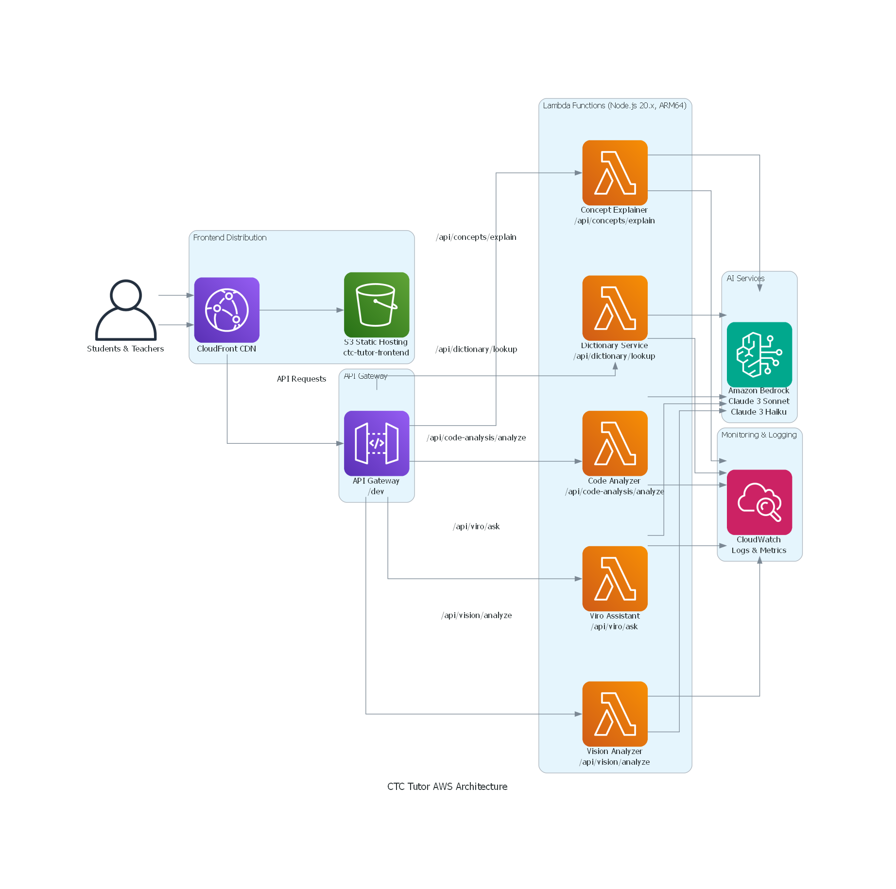

# CTC Tutor - AI-Powered Learning Platform for Bharat

> 🏆 **AI for Bharat Hackathon Submission**

An AI-powered educational platform that makes programming accessible to students across India in 10 regional languages, using Amazon Bedrock and AWS serverless architecture.

## 🌐 Live Demo

- **Production URL**: https://d3hrbeknvapj0l.cloudfront.net
- **Demo Video**: https://youtu.be/AmHjFZov7bc
- **API Endpoint**: https://x1gs5a0o8a.execute-api.us-east-1.amazonaws.com/dev

## 🎯 Problem Statement

**Challenge**: Students in rural India struggle to learn programming due to:
- Language barriers (English-only resources)
- Lack of personalized tutoring
- Limited access to quality educational content
- Difficulty understanding complex programming concepts

**Solution**: CTC Tutor provides AI-powered, multilingual programming education that:
- Explains concepts in 10 Indian languages (Hindi, Marathi, Tamil, Telugu, Bengali, Gujarati, Kannada, Malayalam, Punjabi, English)
- Uses Socratic method for deeper understanding
- Provides instant code analysis and feedback
- Works offline-first for low-connectivity areas
- Completely free and accessible to all

## ✨ Features

### 🌍 Multilingual Support (10 Languages)
- Hindi, Marathi, Tamil, Telugu, Bengali, Gujarati, Kannada, Malayalam, Punjabi, English
- AI-powered translations using Amazon Bedrock
- Voice input and text-to-speech in all languages

### 🧠 AI-Powered Learning Features
- **Concept Explainer**: Multi-layered explanations (intuition → analogy → technical → code)
- **Code Analyzer**: Dry-run tables, complexity analysis, edge cases, best practices
- **Viro AI Tutor**: Socratic method teaching with 6 emotion states
- **One-Tap Dictionary**: Instant technical term explanations with code examples
- **Vision Analysis**: Analyze handwritten code and diagrams via image upload

### 📱 Progressive Web App (PWA)
- Works offline with service workers
- Installable on mobile devices
- Fast loading with IndexedDB caching
- Responsive design for all screen sizes

## 🏗️ AWS Architecture



### Serverless Architecture Components

- **Frontend**: React PWA hosted on S3 + CloudFront CDN
- **API Layer**: API Gateway with REST endpoints
- **Compute**: 5 AWS Lambda functions (Node.js 20.x, ARM64)
  - Concept Explainer Handler
  - Code Analyzer Handler
  - Viro Assistant Handler
  - Dictionary Service Handler
  - Vision Analyzer Handler
- **AI Service**: Amazon Bedrock (Claude 3 Sonnet & Haiku)
- **Monitoring**: CloudWatch Logs, Metrics, and Alarms

**Why AWS Generative AI?**
- Multilingual support requires advanced language models
- Personalized learning needs adaptive AI responses
- Socratic tutoring requires conversational AI
- Code analysis needs deep understanding of programming concepts
- Vision analysis for handwritten code recognition

See [AWS Architecture Documentation](docs/AWS_ARCHITECTURE.md) for detailed information.

## 🛠️ Tech Stack

### Frontend
- React 18 + TypeScript + Tailwind CSS
- Progressive Web App (PWA) with service workers
- Web Speech API for voice input/output
- IndexedDB for offline caching

### Backend (AWS Serverless)
- AWS Lambda (Node.js 20.x, ARM64)
- Amazon Bedrock (Claude 3 Sonnet, Claude 3 Haiku)
- API Gateway (REST API)
- CloudWatch (Monitoring & Logging)

### Infrastructure
- AWS SAM (Serverless Application Model)
- CloudFront CDN
- S3 Static Hosting
- IAM Roles & Policies

## 🚀 Quick Start (Local Development)

### Prerequisites
- Node.js 18+ and npm
- AWS CLI configured with credentials
- AWS SAM CLI installed

### 1. Clone and Install
```bash
git clone <your-repo-url>
cd ctc-tutor
npm run install:all
```

### 2. Set Up Environment Variables
```bash
# Backend
cp backend/.env.example backend/.env
# Add your AWS credentials and region

# Frontend
cp frontend/.env.example frontend/.env
# Set REACT_APP_API_URL=http://localhost:3001/api
```

### 3. Start Development Servers
```bash
npm run dev
```

This starts:
- Backend: http://localhost:3001
- Frontend: http://localhost:3000

## 🚀 Deploy to AWS

### Full Stack Deployment

```bash
# Deploy backend (Lambda + API Gateway)
cd backend
sam build
sam deploy --guided

# Deploy frontend (S3 + CloudFront)
cd ../frontend
npm run build
aws s3 sync build/ s3://your-bucket-name
aws cloudfront create-invalidation --distribution-id YOUR_ID --paths "/*"
```

### Automated Deployment Script
```bash
./deploy-aws.sh
```

See [Setup Guide](docs/SETUP.md) for detailed deployment instructions.

## 📁 Project Structure

```
ctc-tutor/
├── 📱 frontend/                    # React PWA
│   ├── src/
│   │   ├── components/             # UI components
│   │   │   ├── ConceptExplainer.tsx
│   │   │   ├── CodeAnalyzer.tsx
│   │   │   ├── ViroAssistant.tsx
│   │   │   ├── Dictionary.tsx
│   │   │   └── VisionUpload.tsx
│   │   ├── hooks/
│   │   │   └── useVoiceInput.ts    # Voice input hook
│   │   ├── contexts/
│   │   │   └── LanguageContext.tsx # 10 language support
│   │   └── services/
│   │       └── api.ts              # API client
│   └── package.json
├── 🔧 backend/                     # AWS Lambda functions
│   ├── src/
│   │   ├── lambda/handlers/        # 5 Lambda handlers
│   │   │   ├── conceptExplainer.ts
│   │   │   ├── codeAnalyzer.ts
│   │   │   ├── viroAssistant.ts
│   │   │   ├── dictionaryService.ts
│   │   │   └── visionAnalyzer.ts
│   │   └── services/
│   │       ├── bedrockService.ts   # Amazon Bedrock integration
│   │       └── responseParser.ts   # AI response parsing
│   ├── template.yaml               # AWS SAM template
│   └── package.json
├── 📚 docs/                        # Documentation
│   ├── AWS_ARCHITECTURE.md
│   ├── HACKATHON_DOCUMENTATION.md
│   ├── HACKATHON_DEMO_SCRIPT.md
│   └── SETUP.md
├── 🖼️ generated-diagrams/
│   └── ctc-tutor-aws-architecture.png
├── deploy-aws.sh                   # Deployment script
└── README.md
```

## 👥 Team

- **Developer**: Rohana S Mhaishale
- **Contact**:rohanamhaishale@gmail.com

## 📊 Impact & Metrics

- **Target Users**: 10M+ students in rural India
- **Languages Supported**: 10 Indian languages
- **Cost**: Free for all users
- **Accessibility**: Works offline, low bandwidth friendly
- **AWS Free Tier**: Operates within free tier limits

## 🎥 Demo & Documentation

- **Live Demo**: https://d3hrbeknvapj0l.cloudfront.net
- **Demo Video**: https://youtu.be/AmHjFZov7bc
- **Architecture Docs**: [docs/AWS_ARCHITECTURE.md](docs/AWS_ARCHITECTURE.md)
- **Hackathon Docs**: [docs/HACKATHON_DOCUMENTATION.md](docs/HACKATHON_DOCUMENTATION.md)
- **Demo Script**: [docs/HACKATHON_DEMO_SCRIPT.md](docs/HACKATHON_DEMO_SCRIPT.md)

## 🏆 Why This Project Matters

1. **Democratizes Education**: Makes programming accessible in regional languages
2. **AI-Powered Personalization**: Adapts to each student's learning pace
3. **Offline-First**: Works in low-connectivity rural areas
4. **Scalable**: Serverless architecture handles millions of users
5. **Cost-Effective**: AWS free tier keeps it free for students

## 🔧 Available Scripts

```bash
# Install all dependencies
npm run install:all

# Start development servers
npm run dev

# Build for production
npm run build

# Deploy to AWS
./deploy-aws.sh
```

## 🚀 Deployment Options

### AWS Lambda (Primary - Production)
```bash
./deploy-aws.sh
```

### Railway (Backup)
```bash
cd backend
./deploy-railway.sh
```

See deployment documentation for details.

## 🤝 Contributing

Contributions are welcome! Please feel free to submit a Pull Request.

## 📄 License

MIT License - see LICENSE file for details.

## 🙏 Acknowledgments

- AWS for Amazon Bedrock and serverless infrastructure
- Anthropic for Claude AI models
- React and Node.js communities
- AI for Bharat Hackathon organizers

---

**Built with ❤️ for students across Bharat**

*Making quality programming education accessible to everyone, everywhere, in every language.*